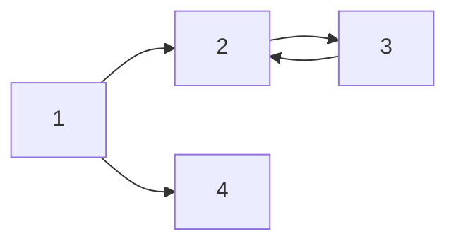

# Movie App 2020

React JS Fundamentals Course 2020

_Italic_
_Italic_
**bold**
**_italic+bold_**
~~hello~~

> 안녕하세요 이건 quote 입니다.

---

- list 1
- list 2
- list 3
  - A
    - B

---

1. list 1
2. list 2
3. list 3
   1. A
      1. B

| 제목 | Description | 비고 |
| ---- | ----------- | ---- |
| 안녕 | 1           | 2    |
| 헬로 | 1           | 2    |

---

[zunee4rang의 블로그]
(github.com/zunee4rang)


---

`simple code`

```cpp
#include <stdio.h>

int main() {
    printf("hello world");
    return 0;
}
```

```sh
.bash_profile
```

---

$a^2 + b^2 = c^2$

다음 중 $n$개를 고르시오

$$(\alpha + \beta)^2 = \alpha^2 + 2 \alpha \beta + \beta^2$$

---


